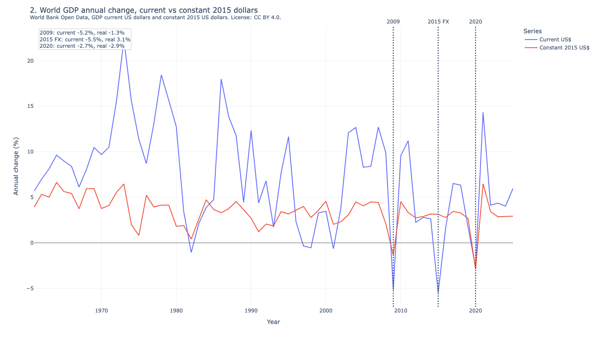
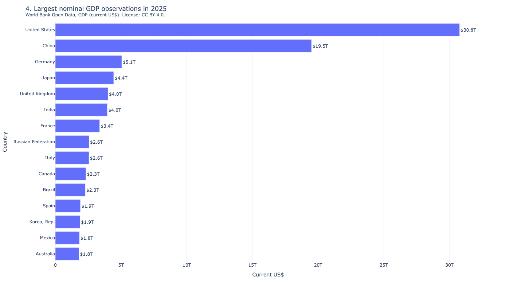
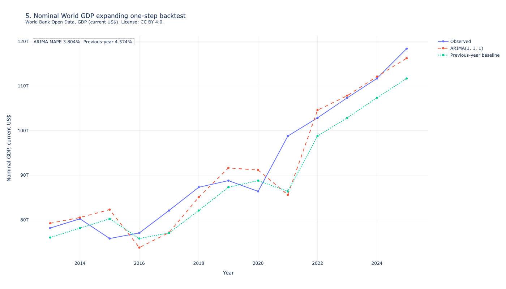
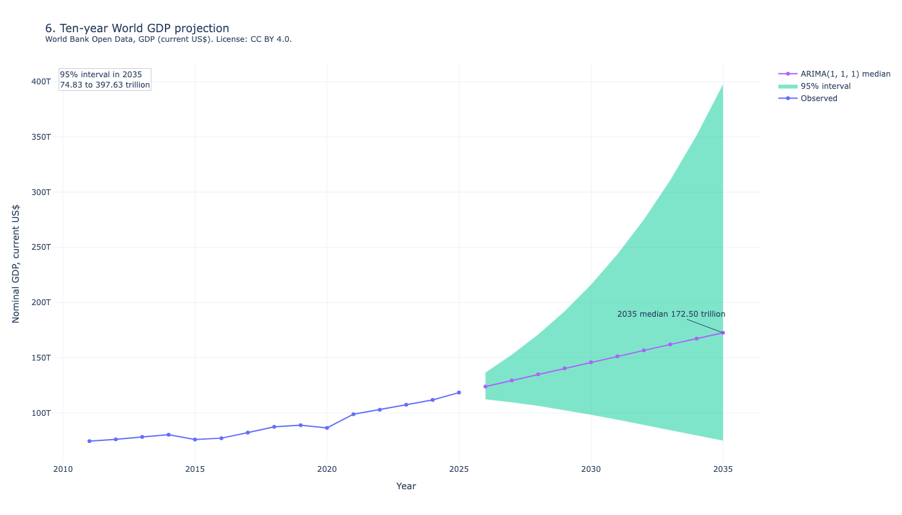

# Global economic impact analysis

[](https://github.com/freechie/global-economic-impact-analysis/actions/workflows/verify.yml)

World nominal GDP rose from $1.37 trillion in 1960 to $118.35 trillion in 2025, an 86.5× increase. That total is the world's output converted into US dollars, so a strong dollar can shrink the number even when economies keep growing. The sharpest year-to-year drops are 2015 at -5.5%, 2009 at -5.2%, and 2020 at -2.7%.

2009: current -5.2%, constant 2015 -1.3%

2015: current -5.5%, constant 2015 3.1%

2020: current -2.7%, constant 2015 -2.9%

Current dollars are the world's output converted into this year's US dollars. That mix includes real output, inflation, and exchange rates. A stronger dollar makes foreign GDP look smaller in dollars. Constant 2015 dollars hold prices at 2015. A rise means the world produced more. A drop means it produced less.

In current dollars, 2015 is the worst year in the series: World GDP fell 5.5%, more than 2009 or 2020. In constant 2015 dollars, 2015 is +3.1%. Output grew. The current-dollar drop is mostly the dollar, not a collapse in production. The notebook labels that point FX. 2015 is a dollar year, not a recession year: the dollar strengthened, so the world total fell in dollars while real output grew 3.1%.

2009 and 2020 fall in both series. 2009 and 2020 are real contractions: output itself fell.

Use current dollars for how large an economy is in dollars this year, including the ranking. Use constant 2015 dollars for whether the world grew or shrank. If current dollars fall and constant dollars rise, it is a dollar year. If both fall, it is a real contraction.

China was 6.1% of U.S. GDP in 1990 and 63.4% in 2025. In dollar terms China went from a small share of the US economy to nearly two-thirds as large. China passed Japan in 2010.

Guessing that next year's world GDP equals this year's was off by 4.574% on average from 2013 to 2025. An ARIMA(1, 1, 1) model that updates each year was off by 3.804%. ARIMA beat that guess, so a ten-year projection is published. The middle estimate for 2035 is $172.50 trillion, from $118.35 trillion in 2025. The 95% range around that path is wide.

The notebook has six interactive charts from World Bank GDP in current US dollars and 2015 dollars, license CC BY 4.0. [Open the executed notebook on GitHub](Global%20Economic%20Impact%20Analysis.ipynb) without installing Python.

## Preview


Current-dollar World GDP. 2015 is the largest drop and is marked FX.



2015: current -5.5%, constant 2015 3.1%. 2009 and 2020 fall in both series.


China passes Japan in 2010. The 1960 China-above-Japan reading is a current-dollar artifact.



United States, China, Germany, Japan, United Kingdom. World Bank aggregates are excluded.



ARIMA MAPE 3.804%. Previous-year baseline 4.574%.



Median $172.50 trillion in 2035. The 95% interval runs from $75 trillion to $398 trillion.

## Install

Install [uv](https://docs.astral.sh/uv/getting-started/installation/). The lockfile pins Python 3.13.

```bash
uv sync --locked --dev
```

## Build

```bash
make verify
```

`make verify` regenerates `data/profiles/public-demo`, executes the notebook, runs tests, and scans the public release. `make` runs the same target.

Rebuild the notebook without tests:

```bash
make notebook
```

Rebuild the README images after a chart change. `make previews` needs Chrome.

```bash
make previews
```

Download the latest World Bank GDP, then rebuild the notebook:

```bash
make fetch
make notebook
```

## Run the notebook

Open `Global Economic Impact Analysis.ipynb` in Cursor or VS Code and select the `.venv` kernel.

Open the notebook in a browser:

```bash
uv run jupyter lab "Global Economic Impact Analysis.ipynb"
```

## Data

`load_analysis_bundle()` reads `data/profiles/public-demo` unless you set `GEIA_DATA_DIR`.

The public profile is two World Bank GDP tables. Set `GEIA_DATA_DIR` to load another complete two-table profile. Git ignores `data/local/`, `data/raw/`, and `data/processed/`. If the chosen directory fails checks, the loader reports the errors. It does not fall back to `public-demo`.

See [`data/README.md`](data/README.md) for the table contract.

## Source

The public extracts are `data/open/world-bank/gdp.csv` and `data/open/world-bank/gdp-real.csv`.

`gdp_annual.csv` is World Bank [GDP (current US$), code NY.GDP.MKTP.CD](https://data.worldbank.org/indicator/NY.GDP.MKTP.CD). `gdp_real_annual.csv` is [GDP (constant 2015 US$), code NY.GDP.MKTP.KD](https://data.worldbank.org/indicator/NY.GDP.MKTP.KD). Both are [CC BY 4.0](https://datacatalog.worldbank.org/public-licenses#cc-by). Normalization dropped invalid and nonpositive rows and flagged aggregates.

Code is [MIT](LICENSE). The GDP files stay CC BY 4.0.
