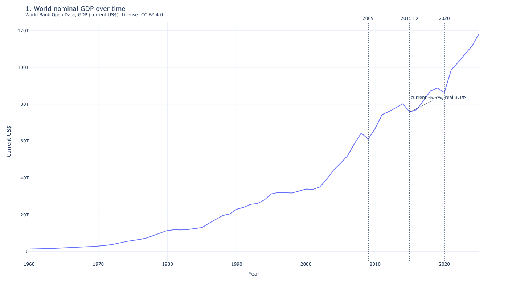
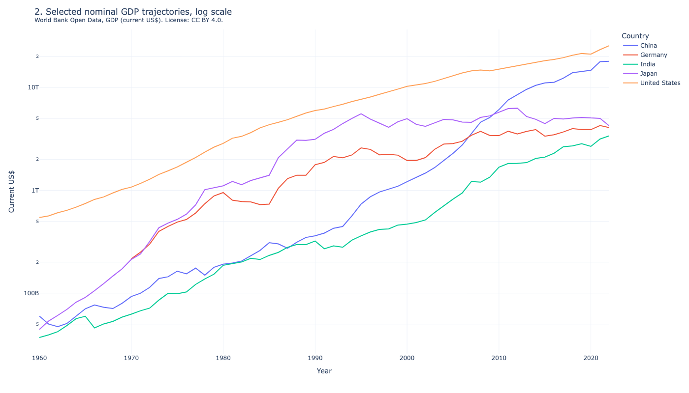
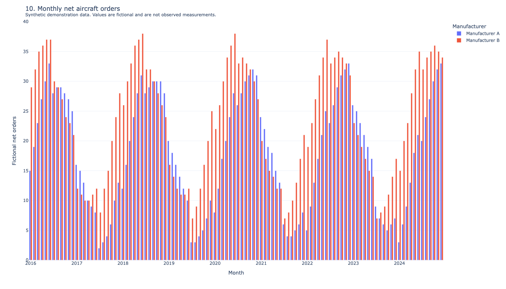

# Global economic impact analysis

[](https://github.com/freechie/global-economic-impact-analysis/actions/workflows/verify.yml)

This repository contains a public, runnable notebook with 14 interactive Plotly figures. Five figures use World Bank GDP open data. Nine figures use deterministic synthetic demonstration data. Synthetic values are fictional and are not observed measurements.

The public demo is self-contained. Clone it to inspect, rerun, and modify every chart without access to the original licensed datasets. You can also [open the executed notebook on GitHub](Global%20Economic%20Impact%20Analysis.ipynb) without installing Python.

## Implementation

- [`src/data_loader.py`](src/data_loader.py) validates profile manifests, SHA-256 hashes, provenance records, and table schemas before exposing data to the notebook.
- [`scripts/build_notebook.py`](scripts/build_notebook.py) rebuilds the notebook and all 14 saved Plotly figures from source.
- [`tests/`](tests/) contains 20 tests for data cleaning, profile validation, chart provenance, notebook integrity, and public-release safety.
- [GitHub Actions](https://github.com/freechie/global-economic-impact-analysis/actions/workflows/verify.yml) recreates the locked environment and runs the same `make verify` command documented below.

## Preview







## Run the public notebook

Install [uv](https://docs.astral.sh/uv/getting-started/installation/). The project pins Python 3.13 and all direct and transitive dependencies in `uv.lock`.

```bash
uv sync --locked --dev
make verify
```

Regenerate the three public-safe README previews after changing a chart. Static preview generation requires Chrome.

```bash
make previews
```

The generator reads the tracked `data/profiles/public-demo/gdp_annual.csv` on a fresh public clone. Pass `--gdp-source` to normalize a separately downloaded World Bank GDP CSV.

## Choose a data profile

`load_analysis_bundle()` uses `data/profiles/public-demo` by default. The public profile contains one open table and seven synthetic tables.

To use a complete compatible local profile, set `GEIA_DATA_DIR` or pass its directory to `load_analysis_bundle(data_dir=...)`. The loader checks the manifest, every required file, every SHA-256 hash, and all canonical schemas before it returns an `AnalysisBundle`. If the selected directory fails validation, the loader reports all detected errors and does not fall back to `public-demo`.

Store local profiles under `data/local/`. Git ignores that directory.

## Figure inventory

The tracked notebook contains these figures:

1. World nominal GDP over time.
2. Selected nominal GDP trajectories.
3. Annual nominal GDP change.
4. Animated nominal GDP by country.
5. Latest nominal GDP ranking.
6. Illustrative inbound transfer activity composition.
7. Illustrative outbound transfer activity.
8. Animated geographic transfer scenarios.
9. Illustrative outbound geographic scenarios.
10. Monthly net aircraft orders for Manufacturer A and Manufacturer B.
11. Illustrative budget categories.
12. Monthly cybersecurity flows for Fund A, Fund B, and Fund C.
13. Regional airline credit spread scenarios for Region A and Region B.
14. Year-end homebuilder confidence scenario.

Each Plotly figure stores a unique chart ID and provenance disclosure in `layout.meta`. Every title also states either the open-data source and license or the synthetic-data disclosure.

## Open-data attribution

`gdp_annual.csv` contains the World Bank indicator [GDP (current US$), code NY.GDP.MKTP.CD](https://data.worldbank.org/indicator/NY.GDP.MKTP.CD). The World Bank makes the data available under the [Creative Commons Attribution 4.0 license](https://datacatalog.worldbank.org/public-licenses#cc-by). The source data were normalized to canonical columns, invalid and nonpositive observations were removed, and aggregate flags were added. The profile manifest records those changes, the covered years, source URL, series code, license, and file hash.

See [`data/README.md`](data/README.md) for the canonical table contract and profile format.

## License

The source code is available under the [MIT License](LICENSE). The World Bank GDP data retain their separate CC BY 4.0 license and attribution requirements.
